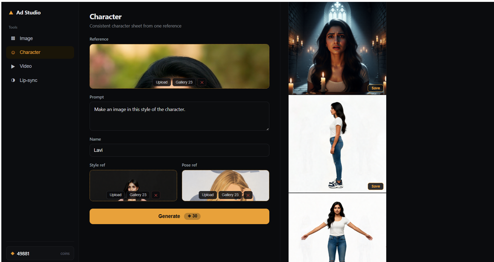
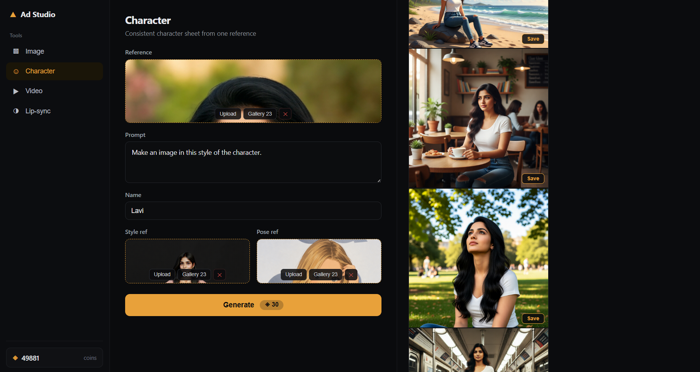
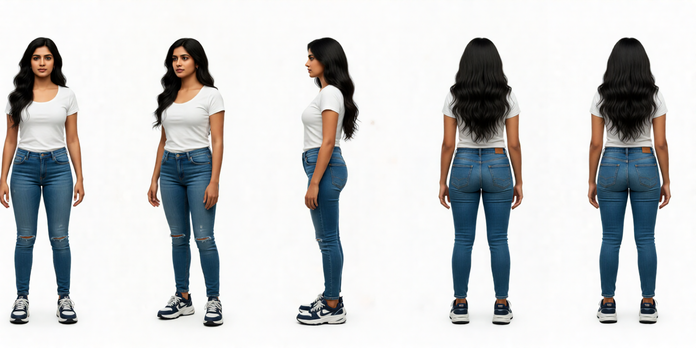

# Ad Studio

**An AI ad-asset pipeline with a single, modular interface — generate a character, put them in a scene, and give them a voice, all from one app.**

Ad Studio wraps four [RunningHub](https://www.runninghub.ai) ComfyUI workflows behind one clean interface. Instead of jumping between separate ComfyUI graphs, you drive image generation, character consistency, image-to-video, and lip-sync from a single OpenArt-style app — and pass results between them freely.

---

## Demo

**The app — one interface for image, character, video, and lip-sync generation:**



**From one reference photo to an ad-ready shot — same character, art-directed scene:**


**The same face held consistent across completely different scenes:**



**A full turnaround set from a single reference:**



**Identity preserved down to the closeup:**


---

## What it does

Four generation tools, each its own panel, runnable in any order:

- **Image** — text-to-image from a prompt, with an optional reference image to guide the result. Portrait/landscape sizing and sampler controls (seed, steps, CFG) exposed.
- **Character** — build a consistent character set from one reference photo, a prompt, a name, and style + pose references. Same identity across turnarounds, closeups, poses, and in-scene shots.
- **Video** — place a character in a scene with up to five reference images (character, outfit, product, background, second character), pick a size and duration (3–15s).
- **Lip-sync** — sync a face to an uploaded audio track for a talking or singing closeup.

Every result lands in a **gallery**. Images render at full aspect ratio, are clickable to open full-size, and each can be **saved individually** (or all at once) to a folder of your choice — with a metadata manifest (prompt, tool, date) written alongside. Any output can also be fed straight into the next tool's inputs, so the character you generate becomes the character in your video, which becomes the face in your lip-sync.

---

## How it's built

```
React + Vite UI  ──HTTP──▶  FastAPI backend  ──REST──▶  RunningHub (ComfyUI workflows)
  three-column app          async job queue              image / character / video / lip-sync
  gallery + save            workflow patcher             graphs run on RunningHub's GPUs
```

**The interesting engineering problem:** These RunningHub workflows are built on free, publicly available ComfyUI workflow templates. They are customised where certain inputs (prompt, duration, size, audio) aren't plain fields — they're encoded as JSON-string "state blobs" inside the node graph. Driving them via the API meant writing a **patcher** that loads each exported workflow graph, rewrites the right values inside those blobs (or the plain fields), and submits only the changed nodes as overrides — leaving every pinned model, VAE, and sampler setting intact. This keeps the app decoupled from the workflows: swapping in a better workflow later is a config change, not a rewrite.

Other design decisions:
- **Modular, not linear** — the pipeline doesn't force an order. Each tool is independent; the shared gallery is the only link, so you compose freely.
- **Async job model** — generations run as background jobs the UI polls, so long video renders don't block the interface.
- **Runtime-aware** — the UI surfaces a coin-cost estimate per generation and shows your live RunningHub balance, because these models bill by GPU time.

---

## Tech stack

- **Backend:** Python, FastAPI, async job orchestration, httpx
- **Frontend:** React, Vite
- **Generation:** RunningHub API, ComfyUI workflow graphs (MiniMax H3 for image/video/audio-sync; Flux Kontext for character consistency)
- **Media:** ffmpeg (video assembly helpers)

---

## Run it locally

**Prerequisites:** Python 3.10+, Node 18+, and a RunningHub account (Personal membership for API access).

**1. Backend**
```bash
cd "ADgen Pipeline"
pip install -r requirements.txt
cp .env.example .env          # then fill in your RunningHub key + workflow IDs
uvicorn adgen.api:app --reload
```

**2. Frontend**
```bash
cd adgen-frontend
npm install
npm run dev
```

Open the Vite URL (usually `http://localhost:5173`). The backend runs on `http://127.0.0.1:8000`. Configuration lives in `.env` (see `.env.example`): your RunningHub API key, region host, and the four workflow IDs.

---

## Credits

Built on free, publicly available ComfyUI workflow templates, using MiniMax H3 and Flux Kontext models, run on [RunningHub](https://www.runninghub.ai). The workflows are used largely as provided; Ad Studio is the API layer, patcher, orchestration, and interface built around them.

---

## Built by Shobie

Shobanashri Harish (Shobie) — Creative Media Producer working at the intersection of Filmmaking and AI. MA in Creative Media Production, NABA Milan; background in Computer Science and Engineering.

- **Film & creative portfolio:** https://canva.link/qwlprjpfxj6ro3y
- **LinkedIn:** https://www.linkedin.com/in/shobanashri-harish-47a21a26b/

*Ad Studio is a personal project exploring how AI generation pipelines can be made usable for real creative production work.*
